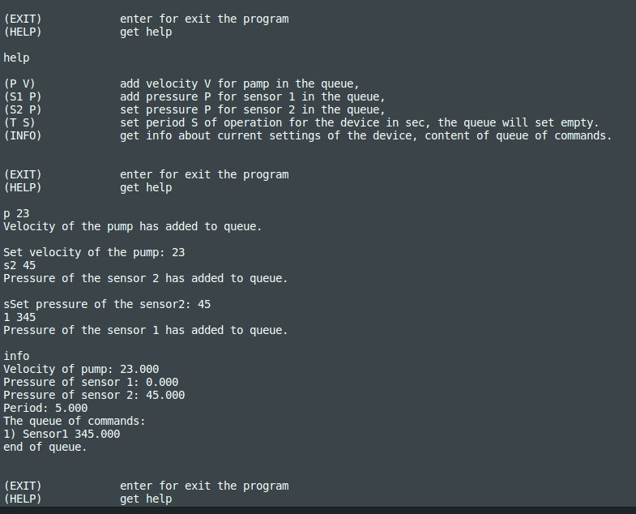
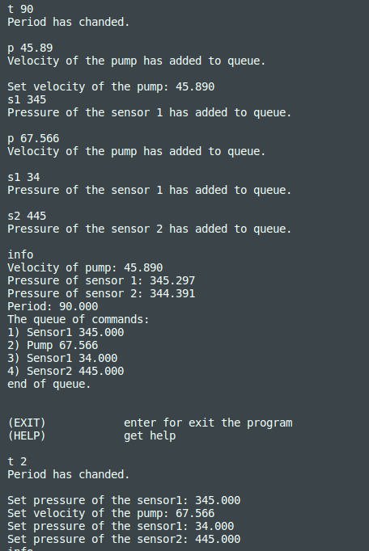

# test_for_geologika

Реализовано управление лабораторным прибором.
Прибор состоит из насоса и двух датчиков давления (Д1, Д2).

Управление происходит через консоль:
- exit - выход из программы;
- help - вызов помощи, какие комманды вводить;
- info - вывода текущего состояния прибора (скорость насоса, давлния датчиков, период, содержание очереди);
- P V - задание скорости V насосу (для остановки ввести P 0);
- S1 P - задание давления P датчику Д1 (для сброса давления ввести S1 0);
- S2 P - задание давления P датчику Д2 (для сброса давления  ввести S2 0);
- T S - задание периода выполнения одной команды (при этом очередь сохраняется).

Обработчик команд выполняется в отдельном потоке. Новые команды кладутся в очередь.

При изменении периода предыдущий период завершается, начинает выполняться следующая команда.

Если в очереди нет команд, чезрез период к текущему значению добавляется случайный шум, не превосходящий 1%.

Для запуска программы имеется makefile с целью all.

